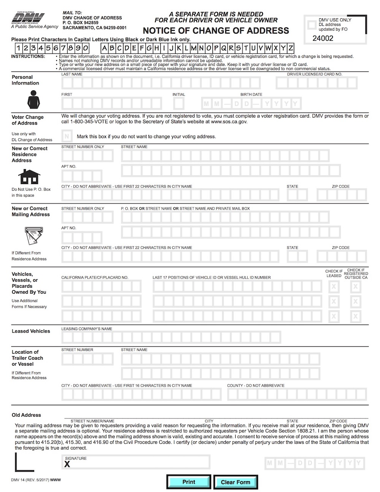
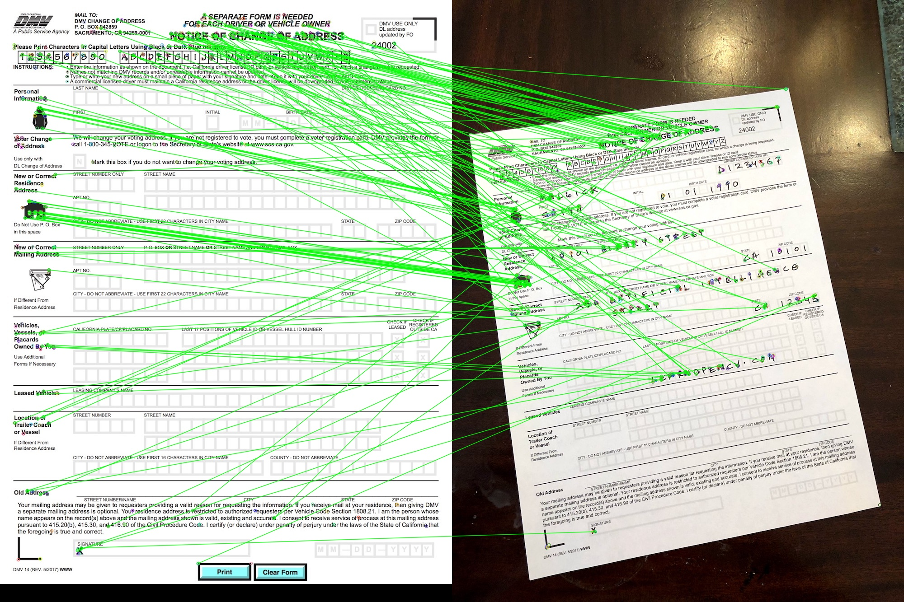
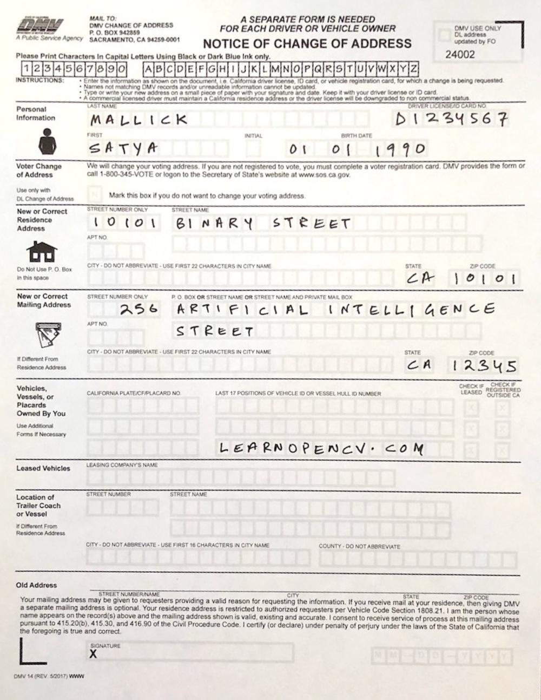

### **📄 Document Picture Alignment: Image Registration Using ORB Features**  


## **📌 Project Description**  
This project aligns a **scanned document** with a reference document using **ORB feature matching and homography transformation**. The program detects keypoints, matches them, and applies a perspective transformation to align the images.

🔹 **Uses ORB feature detection for robust alignment**  
🔹 **Finds keypoint correspondences and calculates homography**  
🔹 **Aligns the scanned document to the reference image**  
🔹 **Saves the aligned output and feature matches**  


## **📂 Project Structure**
```
📦 Document-picture-Alignment
 ┣ 📂 images
 ┃ ┣ 📄 form.jpg               # Reference document image
 ┃ ┗ 📄 scanned-form.jpg       # Scanned document image (to be aligned)
 ┣ 📂 output
 ┃ ┣ 📄 aligned_form.jpg       # Aligned output document
 ┃ ┗ 📄 feature_matches.jpg    # Visualization of matched keypoints
 ┣ 📄 document_alignment.py    # Main script for image alignment
 ┗ 📄 README.md                # Project documentation
```


## **📌 How It Works**
1️⃣ **Loads the reference document and scanned document**  
2️⃣ **Detects ORB keypoints and computes descriptors**  
3️⃣ **Matches features between the two images**  
4️⃣ **Finds homography using RANSAC**  
5️⃣ **Applies perspective transformation to align the images**  
6️⃣ **Saves and displays results**  


## **📌 Setup & Installation**
Make sure you have the required dependencies installed. Run:

```sh
pip install opencv-python opencv-python-headless numpy matplotlib
```


## **📌 Running the Project**
Run the following command to align the scanned document with the reference document:

```sh
python document_alignment.py
```


## **📸 Sample Results**

### **🔹 Before Alignment**
| Reference Image | Scanned Image |
|----------------|--------------|
|  |  |


### **🔹 Feature Matching**
| Feature Matches |
|----------------|
|  |


### **🔹 After Alignment**
| Aligned Document |
|----------------|
|  |


## **🛠 Technologies Used**
- **Python** 🐍  
- **OpenCV (ORB Features & Homography)** 📷  
- **Matplotlib** 📊  


